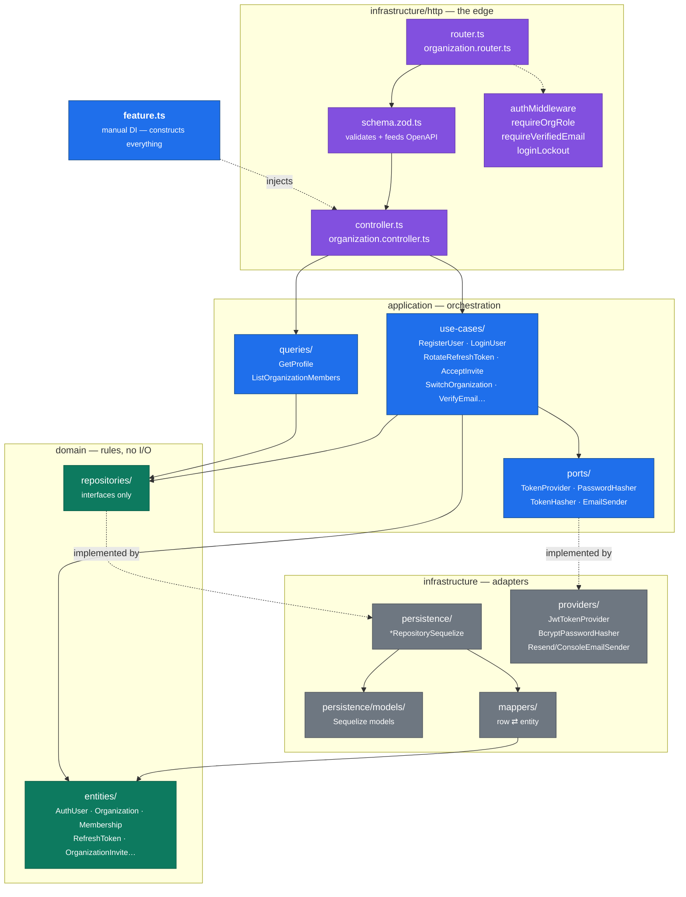

# C4 Level 3 — Components of the auth slice

`src/features/shared/auth/` is the largest slice and the one every other slice depends on. It is
also where multi-tenancy lives: organizations, memberships, and invites are auth concerns because
they decide _who may act in which tenant_.



## The rule the picture encodes

Dependencies point **inward**. `domain/` imports nothing from the layers around it;
`application/` may import `domain/`; `infrastructure/` may import both. Nothing points outward.

The dotted edges are where that is enforced: `application/ports/` declares an interface, and
`infrastructure/providers/` implements it. A use case never imports `JwtTokenProvider` — it takes
a `TokenProvider`. That is what makes `LoginUser` unit-testable with no database, no Redis, and
no clock.

`feature.ts` is the only place the two halves meet. It constructs concrete adapters and injects
them — manual dependency injection, no container:

```ts
const repo = new UserRepositorySequelize();
const hasher = new BcryptPasswordHasher();
const token = new JwtTokenProvider();
const emailSender = overrides.emailSender ?? buildEmailSender();
```

The `overrides` parameter is the seam integration tests use to substitute a fake email sender
without touching the wiring.

## Why auth owns multi-tenancy

`Organization`, `Membership`, and `OrganizationInvite` are auth entities rather than a separate
slice because every one of them answers an authorisation question. A membership _is_ the
statement "this user may act in this organization with this role", which is what `requireOrgRole`
reads. Splitting them out would mean every request crossing a slice boundary to authorise itself.

Role lives on the membership, not the user, because the same person can own one organization and
be a member of another — see
[ADR-0030](../decisions/adr-0030-membership-role-replaces-users-role.md).

## Token handling

Three token types — refresh, password-reset, email-verification — share one shape: generate a
random value, email or return the raw token, and persist **only its SHA-256 hash**. A database
compromise yields no usable tokens
([ADR-0008](../decisions/adr-0008-hash-reset-tokens-never-store-raw.md)).

Refresh tokens add rotation with reuse detection. Each token belongs to a `family_id`; rotating
marks the old row `replaced_by_id`. Presenting an already-replaced token means it leaked, so the
whole family is revoked ([ADR-0019](../decisions/adr-0019-refresh-token-storage-and-rotation.md)).

## Known drift

This slice's `infrastructure/persistence/` is **flat** — seven `*RepositorySequelize.ts` files at
the top level, with only `models/` nested — while `metric` and `metric-log` use the nested
`{models, repositories, mappers}/` layout that `.claude/rules/architecture.md` calls canonical.

The diagram above shows the _intended_ grouping. [ADR-0037](../decisions/adr-0037-resolve-canonical-ddd-layout-disagreement.md)
pins nested as canonical and would migrate this slice — status **Proposed**, so the flat layout is
what you will find in the code today.
