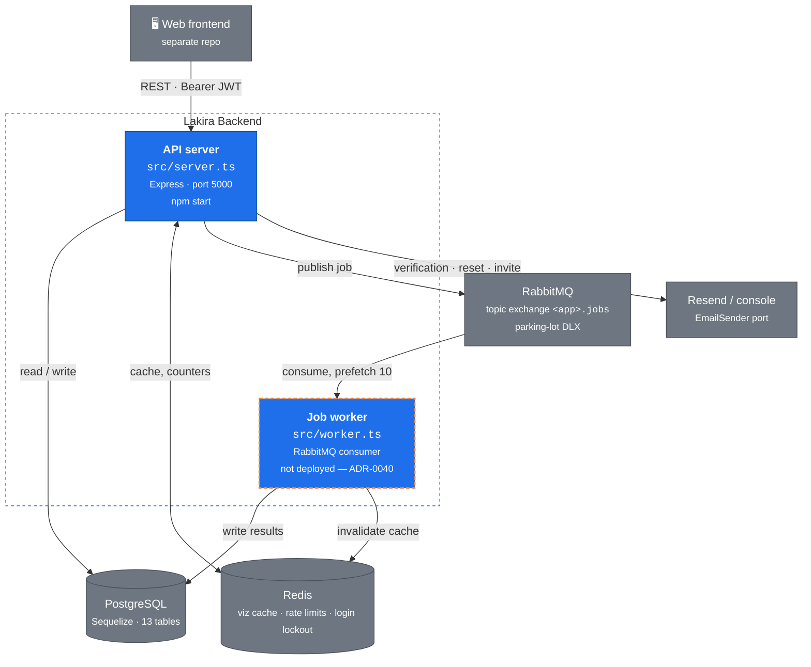

# C4 Level 2 — Containers

Inside the backend: two process types sharing one codebase and one database — but only one of them
is currently deployed anywhere.

> ⚠️ **The job worker has no deployment.** `src/worker.ts` is fully implemented and has npm scripts,
> but there is no Compose service, no Dockerfile `CMD` variant, no CI job, and no Render service that
> runs it. The diagram below shows it dashed for that reason. See
> [ADR-0040](../decisions/adr-0040-worker-process-deployment-topology.md) and
> [`audit-2026-08-17.md`](../../internal/audits/twelve-factor/audit-2026-08-17.md) § Factor VIII.
> Remove this note and the dashed styling in the PR that adds the service.

## The two processes

|             | API server         | Job worker                             |
| ----------- | ------------------ | -------------------------------------- |
| Entry point | `src/server.ts`    | `src/worker.ts`                        |
| Start       | `npm start`        | `npm run worker`                       |
| Deployed?   | yes — Render       | **no** — no service runs it (ADR-0040) |
| Handles     | every HTTP request | queue messages only                    |
| Scales on   | request volume     | queue depth — once deployed            |
| Required?   | yes                | only with `RABBITMQ_ENABLED=true`      |

They share the same `src/`, the same models, and the same database. The worker exists so that
slow or fire-and-forget work does not occupy a request thread — today that is dummy metric-log
generation, consumed from `QUEUES.METRIC_LOG_GENERATE_DUMMY`.

## Request path through the API server

Middleware order in `src/server.ts` is deliberate — each layer assumes the previous one ran:

```mermaid
graph LR
    r["request"] --> cors["cors"] --> cookie["cookie-parser"]
    cookie --> rid["request-id<br/><small>AsyncLocalStorage</small>"]
    rid --> helm["helmet"] --> xss["xss-clean"] --> hpp["hpp"]
    hpp --> trace["disallow TRACE"] --> rl["rate limiter"]
    rl --> route["feature router"] --> auth["authMiddleware<br/><small>per route</small>"]
    auth --> zod["Zod validation"] --> ctrl["controller"] --> uc["use case"]
    uc --> err["error handler"] --> resp["response"]

    classDef sec fill:#8250df,stroke:#6639ac,color:#fff
    classDef app fill:#1f6feb,stroke:#1a4f8a,color:#fff
    class helm,xss,hpp,trace,rl,auth sec
    class route,zod,ctrl,uc app
```

Request-ID runs early so every later log line — including one emitted by the error handler —
carries the same correlation id. It uses `AsyncLocalStorage` rather than a library; see
[ADR-0027](../decisions/adr-0027-asynclocalstorage-for-request-correlation.md).

## Queue topology

A topic exchange with a parking-lot dead-letter exchange: a message that fails past
`RABBITMQ_MAX_RETRIES` is parked rather than dropped or infinitely redelivered.
Publisher and consumer hold separate connections, so a blocked consumer cannot stall publishing
([ADR-0006](../decisions/adr-0006-separate-publisher-and-consumer-connections.md)).

Redelivery makes at-least-once the default, so handlers must be idempotent. The
`processed_messages` table records what has already been handled
([ADR-0007](../decisions/adr-0007-processed-messages-table-for-idempotency.md)).

## What Redis holds

Visualization caches, rate-limit counters, and login-lockout counters — all recomputable. Losing
Redis costs latency and resets counters; it loses no durable state.

> ⚠️ Cache keys are currently scoped by `userId` but **not** `organizationId`. That is an open
> P0: [ADR-0035](../decisions/adr-0035-tenant-scoped-cache-keys.md).

## Next

[Level 3 — the auth component](./c4-components-auth.md) opens the API server.
