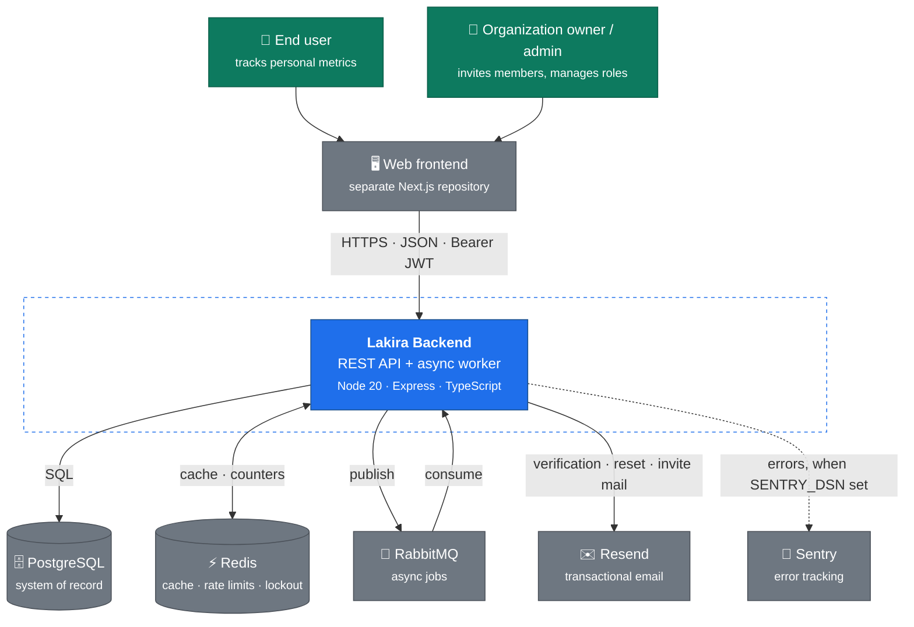

# C4 Level 1 — System context

What the backend talks to, and who talks to it.

## What this shows

**The frontend is a separate repository.** This repo serves JSON only. The contract between them
is the generated OpenAPI spec plus
[`../../reference/frontend-handoff.md`](../../reference/frontend-handoff.md).

**Two kinds of human, one API.** There is no separate admin service. Organization owners and
admins hit the same endpoints; authorisation is a role check on the membership row, not a
different deployment. See [ADR-0030](../decisions/adr-0030-membership-role-replaces-users-role.md).

**Three of the six externals are optional.** RabbitMQ is off unless `RABBITMQ_ENABLED=true` (a
no-op queue is substituted). Sentry is off unless `SENTRY_DSN` is set. Email falls back to a
console adapter unless `EMAIL_PROVIDER=resend`. Redis is required by default but the app degrades
to in-memory rate limiting when `REDIS_REQUIRED=false`.

That optionality is deliberate: a fork should boot with only PostgreSQL running. See
[`../../reference/configuration.md`](../../reference/configuration.md).

**PostgreSQL is the only system of record.** Redis holds nothing that cannot be recomputed.

## Next

[Level 2 — containers](./c4-containers.md) opens the blue box.
